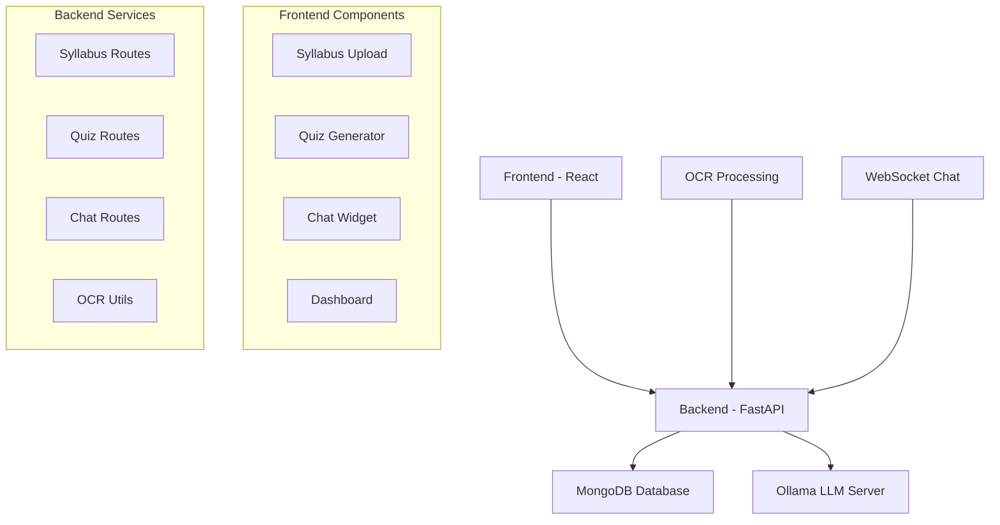

# 🧠 EduMind AI - Personalized Teaching Assistant

<div align="center">


**An intelligent, AI-powered educational platform that transforms learning through personalized syllabus analysis, dynamic quiz generation, and interactive chat assistance.**

[🚀 Live Demo](#) • [📖 Documentation](#) • [🐛 Report Bug](#) • [💡 Request Feature](#)

</div>

---

## ✨ Features

### 🎯 **Smart Syllabus Analysis**
- **OCR-Powered Upload**: Upload PDFs, images, and documents
- **AI-Powered Structuring**: Automatically organizes content into topics and subtopics
- **Learning Objectives**: Extracts key learning objectives and keywords
- **Hierarchical Organization**: Creates structured, navigable content maps

### 🧪 **Dynamic Quiz Generation**
- **Adaptive Difficulty**: Easy, Medium, Hard levels
- **Multiple Question Types**: MCQs, fill-in-blanks, true/false, and more
- **Topic-Specific**: Generate quizzes for any syllabus topic
- **Instant Feedback**: Detailed explanations for each answer

### 💬 **Interactive AI Chat**
- **Real-time Communication**: WebSocket-powered chat interface
- **ELI5 Explanations**: Complex concepts explained simply
- **Context-Aware**: Understands your syllabus and learning progress
- **Personalized Responses**: Tailored to your learning style

### 📊 **Learning Dashboard**
- **Progress Tracking**: Monitor your learning journey
- **Performance Analytics**: Detailed insights into quiz performance
- **Content Overview**: Visual representation of syllabus structure
- **Study Recommendations**: AI-powered study suggestions

---

## 🏗️ Architecture



---

## 🚀 Quick Start

### Prerequisites

- **Docker & Docker Compose**
- **Node.js 18+**
- **Python 3.8+**
- **Ollama** (for local LLM inference)

### Installation

1. **Clone the repository**
   ```bash
   git clone https://github.com/coderaptor071/Edumind.git
   cd Edumind
   ```

2. **Start with Docker Compose**
   ```bash
   docker-compose up --build
   ```

3. **Access the application**
   - Frontend: http://localhost:3000
   - Backend API: http://localhost:8000
   - MongoDB: localhost:27017
   - Ollama: localhost:11434

### Manual Setup

#### Frontend Setup
```bash
cd frontend
npm install
npm start
```

#### Backend Setup
```bash
cd Backend
pip install -r requirements.txt
python main.py
```

#### LLM Server Setup
```bash
cd llm_server
pip install flask
python app.py
```

---

## 🛠️ Technology Stack

### Frontend
- **React 19** - Modern UI framework
- **TypeScript** - Type-safe development
- **React Bootstrap** - Responsive components
- **Tailwind CSS** - Utility-first styling
- **Axios** - HTTP client

### Backend
- **FastAPI** - High-performance API framework
- **MongoDB** - NoSQL database with Motor async driver
- **Pytesseract** - OCR for document processing
- **Pillow** - Image processing
- **PDF2Image** - PDF to image conversion

### AI/ML
- **Ollama** - Local LLM inference
- **Mistral 7B** - Large language model
- **WebSocket** - Real-time communication

### DevOps
- **Docker** - Containerization
- **Docker Compose** - Multi-service orchestration

---

## 📚 API Documentation

### Syllabus Management
```http
POST /syllabus/upload
Content-Type: multipart/form-data

{
  "file": "syllabus.pdf",
  "name": "Computer Science 101"
}
```

### Quiz Generation
```http
POST /quiz/generate
Content-Type: application/x-www-form-urlencoded

{
  "syllabus_id": "syllabus_id",
  "topic": "Data Structures",
  "difficulty": "Medium",
  "num_questions": 10,
  "question_types": "MCQs, True/False"
}
```

### Real-time Chat
```http
WebSocket: ws://localhost:8000/chat/ws
```

---

## 🎯 Use Cases

### For Students
- 📖 **Upload any syllabus** and get instant structure
- 🧠 **Generate practice quizzes** for any topic
- 💬 **Ask questions** and get ELI5 explanations
- 📈 **Track progress** with detailed analytics

### For Educators
- ⚡ **Quick content analysis** of teaching materials
- 🎯 **Create targeted assessments** automatically
- 📊 **Monitor student engagement** and performance
- 🔄 **Adapt teaching methods** based on AI insights

### For Institutions
- 🏗️ **Standardize curriculum** across departments
- 📚 **Build knowledge repositories** with AI structuring
- 🎓 **Enhance learning outcomes** through personalization
- 💰 **Reduce content creation** time and costs

---

## 🔧 Configuration

### Environment Variables

Create a `.env` file in the Backend directory:

```env
MONGODB_URI=mongodb://localhost:27017/edu_mind_ai
OLLAMA_BASE_URL=http://localhost:11434
MODEL_NAME=mistral:7b
```

### Docker Configuration

The `docker-compose.yml` file includes:
- **Backend service** on port 8000
- **Frontend service** on port 3000
- **MongoDB** on port 27017
- **Ollama** on port 11434

---

### Development Workflow
1. Fork the repository
2. Create a feature branch (`git checkout -b feature/amazing-feature`)
3. Commit your changes (`git commit -m 'Add amazing feature'`)
4. Push to the branch (`git push origin feature/amazing-feature`)
5. Open a Pull Request

---

## 📄 License

This project is licensed under a custom license - see the [LICENSE](LICENSE) file for details.

**⚠️ Important**: This software is **NOT** open for commercial use. Any commercial application, redistribution, or derivative works require explicit written permission from the author. Educational and personal use is permitted with proper attribution.

---

## 🙏 Acknowledgments

- **Ollama** for providing local LLM inference
- **Mistral AI** for the powerful language model
- **FastAPI** for the excellent web framework
- **React** for the amazing frontend framework

---
---

<div align="center">

**Made with ❤️ by Neighbourhood Raptor🐊**

[](https://github.com/coderaptor071/Edumind)
[](https://github.com/coderaptor071/Edumind)
[](https://github.com/coderaptor071/Edumind/issues)

</div>
